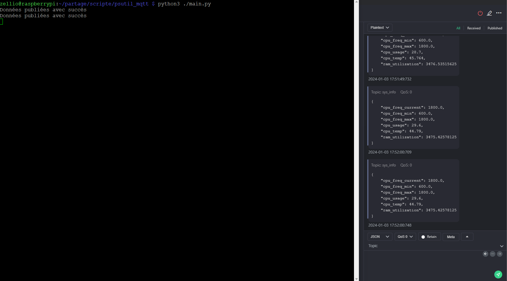

# Sys_info
Le script suivant permet de publier sur votre broker MQTT les informations suivantes :
| Clef | type |Commentaire|
|-----------|-----------|-----------|
|"cpu_freq_current": |Float|Fréquence actuelle du CPU|
|"cpu_freq_min": |Float|Fréquence mini du CPU|
|"cpu_freq_max": |Float|Fréquence Maxi du CPU|
|"cpu_usage": |Float |% d'utilisation du CPU|
|"cpu_temp": |Float|en °C|
|"ram_usage": |Float|en Mb|
|"disk_usage":|Float|en %|
|"time_now":|Str|Heure actuelle|
|"boot_time":|Str |Heure du Boot|
|"up_time":|Str |temps de fonctionnement|

## Instalation 
Clônez le dépôt avec la commande suivante :

```bach
git clone https://github.com/zellio22/psutil_mqtt
```

```bash 
cd ./psutil_mqtt/

```
## Instalation des dependances

Installez les dépendances requises avec les commande suivante :

```bach
pip install pypi-json
```
```bach
pip install psutil
```
```bach
pip install paho-mqtt
```
Ou 
```bash
pip install -r requirement.txt
```
## Configuration 

Toute la configuration doit être réalisée dans le Fichier [config.json](./config.json)
```json
{
    "config":{
        "broker_address" :"127.0.0.1",  # Adresse du Broker MQTT 
        "port_mqtt":1883,               # Port du Broker
        "topic":"sys_info",             # Topic des messages 
        "timing":10,                    # Temps entre 2 publication 
        "username":"",                  # Votre nom d'utilisateur du Brocker
        "password":""                   # Votre Mot de passe du Brocker
    },
    
    "system_info":{
        "cpu_freq_current":true,        #true = publie la valeur
        "cpu_freq_min":false,           #false = ne publie pas la valeur
        "cpu_freq_max":false,
        "cpu_usage":true,
        "cpu_temperature":true,
        "ram_usage":true,
        "disk_usage":true,
        "time_now":true,
        "boot_time":true,
        "up_time":true
    },

    "service":{                         # Permet de suivre l'etat d'un service 
        "service1":"apache2",           # ces ligne peuvent être supprimer 
        "service2":"ssh"                # Ou ajouter si l'ont souhaite suivre plusieurs service
    }

}
```


## Execution 

Exécutez le script avec la commande suivante :
```bash 
python3 ./main.py
```
## Docker mosquitto
mosquitto.conf
```
# /mosquitto/config/mosquitto.conf

listener 1883
allow_anonymous true
```

Start du brocker MQTT sur le port 1883
```bash
docker run -d -p 1883:1883 --name mosquitto -v /home/user/psutil_mqtt/mosquitto.conf:/mosquitto/config/mosquitto.conf eclipse-mosquitto
```

## Screen 

